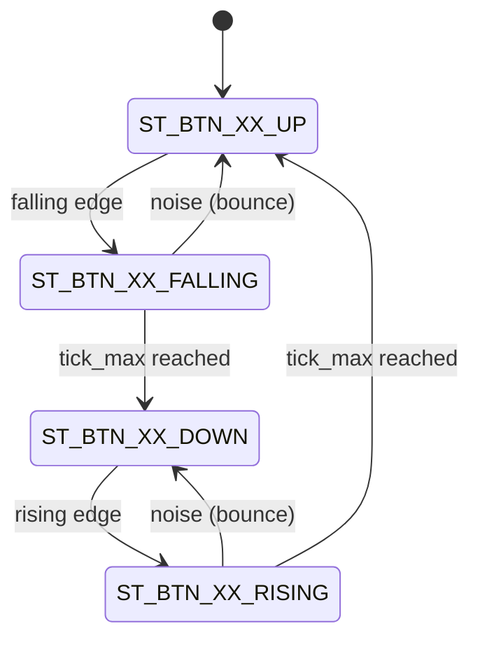

# Final Work Report — Embedded Systems (86.65)

## EMG Interface for Muscle Activity Monitoring

**Author:** Luciana B. Falcon  
**Student ID:** 107316  
**Year:** 2025 | 2nd Semester  
**Course:** Embedded Systems Workshop (86.65)

_This work was carried out in the Autonomous City of Buenos Aires, between December 2025 and February 2026._

---

## Abstract

This work presents the development of an embedded system capable of acquiring, processing, and displaying muscle bioelectric signals (EMG) using non-invasive surface electrodes. The system uses a NUCLEO-F103RB board with an STM32 microcontroller to digitize the signal provided by the AD8232 module, compute the muscle activation level using a sliding window average and threshold detection with hysteresis, and transmit the results to both a local LCD display and an ESP32 module via UART. The work demonstrates the integration of multiple peripherals in a bare-metal super-loop architecture, with a CPU load factor of approximately 7.29%. The implementation covers all stages of bioelectric processing: analog sensing, conditioning, digitization, processing, and communication.

---

## Table of Contents

1. [General Introduction](#chapter-1-general-introduction)
   - 1.1 [System Description](#11-system-description)
   - 1.2 [Motivation and Importance](#12-motivation-and-importance)
   - 1.3 [How an Electromyogram Works](#13-how-an-electromyogram-works)
   - 1.4 [Analysis of Similar Systems](#14-analysis-of-similar-systems)
2. [Specific Introduction](#chapter-2-specific-introduction)
   - 2.1 [Requirements](#21-requirements)
   - 2.2 [Use Cases](#22-use-cases)
   - 2.3 [AD8232 Module](#23-ad8232-module)
   - 2.4 [ESP32 Module](#24-esp32-module)
   - 2.5 [LCD Display](#25-lcd-display)
3. [Design and Implementation](#chapter-3-design-and-implementation)
   - 3.1 [Hardware](#31-hardware)
     - 3.1.1 [Microcontroller Board](#311-microcontroller-board)
     - 3.1.2 [Potentiometer B10K](#312-potentiometer)
     - 3.1.3 [AD8232 Module and Electrodes](#313-ad8232-module-and-electrodes)
     - 3.1.4 [LCD 16×2 Display](#314-lcd-162-display)
     - 3.1.5 [Keypad](#315-keypad)
     - 3.1.6 [Buzzer](#316-buzzer)
     - 3.1.7 [ESP32 Module](#317-esp32-module)
   - 3.2 [Microcontroller Firmware](#32-microcontroller-firmware)
     - 3.2.1 [Sensor Task](#321-sensor-task)
     - 3.2.2 [EMG Acquisition Task](#322-emg-acquisition-task)
     - 3.2.3 [Processing and Detection Task](#323-processing-and-detection-task)
     - 3.2.4 [LCD Visualization Task](#324-lcd-visualization-task)
     - 3.2.5 [UART Transmission Task](#325-uart-transmission-task)
   - 3.3 [ESP32 Module Firmware](#33-esp32-module-firmware)
4. [Testing and Results](#chapter-4-testing-and-results)
   - 4.1 [Hardware Functional Tests](#41-hardware-functional-tests)
   - 4.2 [Firmware Functional Tests](#42-firmware-functional-tests)
   - 4.3 [Integration Tests](#43-integration-tests)
   - 4.4 [Energy Consumption Measurement and Analysis](#44-energy-consumption-measurement-and-analysis)
   - 4.5 [Execution Time Measurement and Analysis](#45-execution-time-measurement-and-analysis)
   - 4.6 [Requirements Compliance](#46-requirements-compliance)
   - 4.7 [Comparison with Similar Systems](#47-comparison-with-similar-systems)
   - 4.8 [Development Documentation](#48-development-documentation)
5. [Conclusions](#chapter-5-conclusions)
   - 5.1 [Results Obtained](#51-results-obtained)
   - 5.2 [Next Steps](#52-next-steps)
6. [Bibliography](#bibliography)

---

## CHAPTER 1: General Introduction

### 1.1 System Description

The project consists of the development of an embedded system capable of acquiring, processing, and displaying muscle bioelectric signals (EMG) using non-invasive surface electrodes. EMG signals are generated by the electrical activity of the muscle during contraction and appear in the millivolt range, which requires amplification and filtering before digitization.

The system enables the detection of muscle contractions through digital processing on the STM32 microcontroller, based on a NUCLEO-F103RB board and programmed in C, displaying results on a local LCD display and sending data via UART to an ESP32 module for remote analysis or visualization.

The main objective is to design a complete embedded system that integrates all stages of biological processing:

- Analog sensing (electrodes + AD8232 amplifier).
- Conditioning and digitization (STM32 ADC).
- Processing and event detection (embedded software).
- Communication and visualization (UART + ESP32 + LCD display).

### 1.2 Motivation and Importance

EMG signal monitoring has direct applications in physical rehabilitation, human-machine interfaces, muscle fatigue detection, and assistive systems for people with motor disabilities. Most commercially available systems are expensive, large, or require specialized medical equipment. This work proposes a compact, low-cost alternative based on open hardware, which can be used in research contexts as well as educational or personal applications.

This work is particularly notable for integrating all stages of EMG processing into a single bare-metal embedded system — from analog acquisition to wireless transmission — with a reduced CPU load factor (7.29%) that leaves room for future expansions.

### 1.3 How an Electromyogram Works

An electromyographic (EMG) signal is a recording of the electrical activity generated by muscle fibers during contraction. When the central nervous system sends a signal to a muscle, motor neurons activate groups of muscle fibers called motor units. Each motor unit generates a characteristic action potential which, combined with those of other active units, produces the EMG signal observable on the skin surface.

The main characteristics of the surface EMG signal are:

- **Amplitude:** between 0.1 mV and 5 mV under normal surface recording conditions.
- **Frequency range:** between 20 Hz and 500 Hz, with higher energy content in the 50–150 Hz band.
- **Nature:** stochastic, non-stationary, and strongly dependent on the level of muscular effort.

For acquisition, surface electrodes are placed on the skin over the area of interest. The potential difference recorded between two active electrodes, with reference to a third neutral electrode, is amplified using a high-input-impedance, high-common-mode-rejection (CMRR) instrumentation amplifier to attenuate power line noise (50/60 Hz) and other artifacts.

Typical EMG signal processing includes the following stages:

1. Amplification and analog filtering (20–450 Hz bandpass), performed in this work by the AD8232 module.
2. Digitization via ADC at a sampling frequency ≥ 1 kHz, handled by the STM32's ADC1.
3. Computation of the average value in 8-sample windows as an indicator of muscle activation level (see Section 3.2).
4. Detection of contraction events by comparison with user-calibrated hysteresis thresholds (see Section 3.2).

Figure 3.1 shows the block diagram of the system developed in this work, which implements all the stages mentioned above.

### 1.4 Analysis of Similar Systems

Table 1.1 presents a comparison between the system developed in this work and two representative solutions available on the market: the [MyoWare 2.0](https://myoware.com/products/muscle-sensor/) combined with Arduino, aimed at low-cost educational and prototyping projects, and the [OpenBCI Cyton](https://openbci.com/), a high-end research platform with multi-channel support and wireless connectivity. The proposed system is positioned as a low-cost alternative that incorporates features absent in both commercial solutions, such as local visualization, guided calibration, and threshold alert.

<div align="center">

| System                |   Microcontroller    | Connectivity |   Display    | Approx. Cost |
| --------------------- | :------------------: | :----------: | :----------: | :----------: |
| MyoWare 2.0 + Arduino |      ATmega328P      |    Serial    | Not included |   ~$50 USD   |
| OpenBCI Cyton         |        PIC32         | Wi-Fi / BLE  | Not included |  ~$1249 USD  |
| **This work**         | STM32 (NUCLEO-F103RB) | UART + ESP32 |   LCD 16×2   |   ~$40 USD   |

_Table 1.1: Preliminary comparison with similar systems._

</div>

The main advantage of the developed system over commercial alternatives is its low cost, integrated local visualization, guided calibration routine, and complete embedded processing without dependency on external software for contraction detection.

---

## CHAPTER 2: Specific Introduction

### 2.1 Requirements

#### Development Platform

- **Board used:** NUCLEO-F103RB
- **Microcontroller:** STM32F103RB (ARM Cortex-M3, 64 MHz)
- **Firmware architecture:** Super Loop (bare-metal, event-triggered)

#### Functional Requirements

Table 2.1 summarizes the essential functions the system must perform to meet the project objectives. Each requirement is encoded with a unique identifier to enable traceability in design and implementation.

<div align="center">

| Code | Functional Requirement                                                                               |
| :--: | ---------------------------------------------------------------------------------------------------- |
|  FR1  | The system must acquire the EMG signal via electrodes connected to the AD8232 module.               |
|  FR2  | The system must digitize the signal with the STM32 ADC at at least 1 kHz.                           |
|  FR3  | The system must process the signal (window average, threshold with hysteresis).                     |
|  FR4  | The system must display the muscle activity level on the LCD display.                               |
|  FR5  | The system must transmit processed data via UART to the ESP32 module.                               |
|  FR6  | The system must activate a buzzer when muscle activity exceeds a configurable threshold.            |
|  FR7  | The system must allow starting/stopping monitoring via a button.                                    |
|  FR8  | The system must implement a guided calibration routine to determine detection thresholds.           |

_Table 2.1: Functional requirements._

</div>

#### Non-Functional Requirements

Table 2.2 presents the performance constraints and operating conditions the system must meet.

<div align="center">

| Code  | Non-Functional Requirement                                                    |
| :---: | ----------------------------------------------------------------------------- |
| NFR1  | The system must maintain a consumption below 20 mA in standard operation.     |
| NFR2  | UART communication to the ESP32 must be continuous during monitoring.         |
| NFR3  | The display must be updated at least every 100 ms.                            |
| NFR4  | Contraction detection must occur with a latency of less than 50 ms.           |
| NFR5  | The firmware must be implemented in super-loop architecture.                  |

_Table 2.2: Non-functional requirements._

</div>

### 2.2 Use Cases

#### Use Case 1: Muscle Activity Monitoring

<div align="center">

| Item               | Description                                               |
| ------------------ | --------------------------------------------------------- |
| **Actors**         | User, EMG System.                                         |
| **Preconditions**  | The device is powered on and the electrodes are in place. |

_Table 2.3: Use case 1._

| Step | Action                                                                                        |
| :--: | --------------------------------------------------------------------------------------------- |
|  1   | The user presses the ENTER button to start monitoring.                                        |
|  2   | The system begins sampling the EMG signal on both channels.                                   |
|  3   | The signal is processed and the muscle activation level is calculated using window averaging.  |
|  4   | The processed value is shown on the LCD display and sent via UART to the ESP32.               |
|  5   | If the level exceeds the calibrated threshold, the buzzer is activated.                       |

_Table 2.4: Main flow._

| Step | Action                                                                                        |
| :--: | --------------------------------------------------------------------------------------------- |
|  A1  | The user presses the STOP button and the system halts acquisition and returns to IDLE state.  |

_Table 2.5: Alternative flow._

</div>

#### Use Case 2: Threshold Calibration

<div align="center">

| Item                    | Description                                                                                                                                                                 |
| ----------------------- | --------------------------------------------------------------------------------------------------------------------------------------------------------------------------- |
| **Actor**               | User, EMG System.                                                                                                                                                           |
| **Preconditions**       | The device is powered on and the electrodes are correctly placed.                                                                                                           |
| **Postconditions**      | The thresholds `calib_threshold_high` and `calib_threshold_low` are configured for the session.                                                                             |
| **General Description** | The system guides the user through a sequence of rest and contraction to measure the extreme signal levels and automatically calculate detection thresholds with hysteresis. |

_Table 2.6: Use case 2._

| Step | Action                                                                                                               |
| :--: | -------------------------------------------------------------------------------------------------------------------- |
|  1   | The user presses the CALIB button. The buzzer sounds briefly as a start signal.                                      |
|  2   | The system prompts the user to relax the muscle for 10 seconds and averages the ADC samples.                         |
|  3   | The buzzer sounds again. The system prompts the user to contract the muscle for 10 seconds and averages the samples.  |
|  4   | The system calculates thresholds at 75% and 25% of the measured range and confirms with a final beep.               |

_Table 2.7: Calibration flow._

</div>

### 2.3 AD8232 Module

The [AD8232](https://www.analog.com/en/products/ad8232.html) module is a biopotential signal acquisition integrated circuit designed by Analog Devices. It incorporates an instrumentation amplifier, bandpass filters, and a configurable gain amplification stage, making it suitable for capturing EMG signals in the range of 0.5 mV to 3.5 mV. The output is an analog voltage in the range of 0 V to 3.3 V, directly compatible with the STM32 ADC. It was chosen for its low cost (~$3 USD), easy integration with 3.3 V microcontrollers, and availability in the local market.

### 2.4 ESP32 Module

For data transmission to an external device, an [ESP32](https://cdn.sparkfun.com/datasheets/IoT/esp32_datasheet_en.pdf) module was used, which receives muscle activation data from the STM32 via UART (USART3, pins PC10/PC11 with partial AFIO remap) and can forward it over Wi-Fi or Bluetooth to a PC or mobile device. Communication was established at 4800 bps. It was chosen for its low cost, integrated wireless communication capability, and ease of programming.

### 2.5 LCD Display

The 16×2 character LCD display is connected in 4-bit mode to the board's GPIO pins. The `LCD_show()` function implemented in the firmware allows updating both rows of the display in a single call, clearing the previous content and writing new strings. The display is updated every 1000 super-loop ticks to show the activation level and contraction state of each channel in real time.

---

## CHAPTER 3: Design and Implementation

### 3.1 Hardware

Figure 3.1 shows the general block diagram of the system. The core of the system is the NUCLEO-F103RB board with the STM32F103RB microcontroller, which centralizes data acquisition, processing, and communication. Two AD8232 modules capture the muscle signal (potential difference) from each channel and deliver it to the STM32 ADC. The processed results are transmitted in real time to the 16×2 LCD display and to the ESP32 module for wireless retransmission to a PC. Three buttons from the keypad control the application flow, and the buzzer emits audible alerts upon detected contractions and during calibration.


_Figure 3.1: Block diagram of the EMG interface system._

<div align="center">

| Component          | Description                               |     Connection to STM32      |
| ------------------ | ----------------------------------------- | :--------------------------: |
| NUCLEO-F103RB      | Development board with STM32F103RB        |              —               |
| AD8232 Module (×2) | EMG signal amplifier                      | ADC1 CH0 (PA0) / CH1 (PA1)  |
| LCD 16×2 Display   | Local visualization (4-bit mode)          |         GPIO (PA/PB)         |
| ESP32 Module       | Wireless communication                    |      USART3 (PC10/PC11)      |
| Buzzer             | Audio alert                               |    GPIO (BUZZER_PORT/PIN)    |
| ENTER Button       | Start monitoring                          |       GPIO with pull-up      |
| CALIB Button       | Start calibration                         |       GPIO with pull-up      |
| STOP Button        | Stop monitoring                           |       GPIO with pull-up      |
| Electrodes (×6)    | Muscle signal capture (3 per channel)     |         AD8232 input         |

_Table 3.1: System bill of materials._

</div>

#### 3.1.1 Microcontroller Board

The NUCLEO-F103RB board is the core of the system. It features an STM32F103RB microcontroller (ARM Cortex-M3 at 64 MHz), configured using an internal PLL (HSI/2 × 16). This board was chosen because it is the platform adopted by the course and has all necessary features: 12-bit ADC, multiple UARTs, and sufficient GPIOs to connect all system peripherals. Figure 3.2 shows the board used.

<div align="center">

</div>

_Figure 3.2: NUCLEO-F103RB board used as the development platform._

#### 3.1.2 Potentiometer

A linear B10K (10 kΩ) potentiometer was included as a manual adjustment element for the detection threshold level. Its center wiper is connected to an STM32 ADC pin, allowing an analog value between 0 and 3.3 V to be read, which can be used to adjust the system sensitivity in real time without recompiling the firmware.

<div align="center">

</div>

#### 3.1.3 AD8232 Module and Electrodes

The AD8232 module handles the amplification and analog filtering of the muscle signal before digitization. Two modules were used in parallel to monitor two muscle channels simultaneously. Each module requires three electrodes: two active electrodes placed over the muscle of interest and one reference electrode on a neutral area. The analog output of each module is connected to a channel of the STM32's ADC1 (PA0 for channel 1 and PA1 for channel 2).

<div align="center">

</div>

#### 3.1.4 LCD 16×2 Display

The 16×2 character LCD display is connected to the STM32 in 4-bit mode, using GPIO pins from ports A and B. The `LCD_show()` function implemented in the firmware allows updating both rows in a single call. The top row shows the activation level and state of channel 1, and the bottom row shows those of channel 2.

<div align="center">

</div>

#### 3.1.5 Keypad

The system has three push buttons with pull-up resistors that control the application flow:

- **ENTER:** starts the EMG monitoring session.
- **CALIB:** starts the guided calibration routine.
- **STOP:** stops active monitoring.

The processing of events generated by these buttons, including state machine debouncing, is described in Section 3.2.1.

<div align="center">

</div>

#### 3.1.6 Buzzer

The buzzer is a passive actuator controlled via a GPIO pin on the STM32. It activates when the average muscle activation level exceeds the calibrated high threshold, and deactivates when it falls below the low threshold. It is also used during the calibration routine as an audible warning to indicate the start of each stage.

<div align="center">

</div>

#### 3.1.7 ESP32 Module

The ESP32 module receives muscle activation data from the STM32 via USART3 (pins PC10/PC11 with partial AFIO remap) at 4800 bps. Data is sent in CSV format (`emg1,emg2,STATE1,STATE2\n`) and the ESP32 can forward it over Wi-Fi or Bluetooth to a PC or mobile device for remote visualization.

<div align="center">

</div>

---

### 3.2 Microcontroller Firmware

The firmware was developed in C, implementing a **super-loop (bare-metal)** architecture with a main state machine managed by the `task_menu` task. No real-time operating system (RTOS) was used.

Table 3.2 summarizes the tasks that make up the super-loop:

<div align="center">

| Task                  | Description                                       |   Period    |
| --------------------- | ------------------------------------------------- | :---------: |
| Sensor Task           | Button reading with state machine debouncing      |  Per tick   |
| EMG Acquisition Task  | Continuous sampling of two channels (PA0 and PA1) |  Continuous |
| Processing Task       | Window average, threshold detection, and buzzer   |  Per tick   |
| LCD Task              | Display refresh with level and state              | 1000 ticks  |
| UART Task             | Data transmission to ESP32 in CSV format          | 1000 ticks  |

_Table 3.2: Super-loop tasks._

</div>

The main state machine (`task_menu`) has the following states:

<div align="center">

| State               | Description                                             |
| ------------------- | ------------------------------------------------------- |
| `ST_IDLE`           | System waiting. Awaits ENTER or CALIB event.            |
| `ST_ACQUIRING`      | Active acquisition and processing of EMG signal.        |
| `ST_CALIB_BUZZ1`    | First warning beep at the start of calibration.         |
| `ST_CALIB_REST`     | Rest level measurement for 10 seconds.                  |
| `ST_CALIB_BUZZ2`    | Second warning beep before contraction.                 |
| `ST_CALIB_CONTRACT` | Contraction level measurement for 10 seconds.           |
| `ST_CALIB_BUZZ3`    | Final confirmation beep after calibration is complete.  |

_Table 3.3: Main state machine states._

</div>

#### 3.2.1 Sensor Task

The `task_sensor` task manages reading the three buttons (ENTER, CALIB, STOP), implementing a 4-state machine per button for debouncing:



_Figure 3.2.1: Possible states of the button state machines._

<div align="center">

| State               | Description                                                                           |
| ------------------- | ------------------------------------------------------------------------------------- |
| `ST_BTN_XX_UP`      | Button released. Awaits falling edge.                                                 |
| `ST_BTN_XX_FALLING` | Edge detected. Counts `tick_max` ticks before confirming the press.                   |
| `ST_BTN_XX_DOWN`    | Button confirmed as pressed. Awaits rising edge.                                      |
| `ST_BTN_XX_RISING`  | Rising edge detected. Counts `tick_max` ticks before confirming release.              |

_Table 3.4: Button debouncing state machine states._

</div>

The filter time is configured with `DEL_BTN_XX_MAX = 50` ticks. Only when the button remains at the same logic level for that duration is the corresponding event generated to the `task_menu` task, avoiding mechanical bouncing:

```c
case ST_BTN_XX_FALLING:
    p_task_sensor_dta->tick--;
    if (DEL_BTN_XX_MIN == p_task_sensor_dta->tick)
    {
        if (EV_BTN_XX_DOWN == p_task_sensor_dta->event)
        {
            put_event_task_menu(p_task_sensor_cfg->signal_down);
            p_task_sensor_dta->state = ST_BTN_XX_DOWN;
        }
        else
        {
            p_task_sensor_dta->state = ST_BTN_XX_UP;
        }
    }
    break;
```

#### 3.2.2 EMG Acquisition Task

ADC1 was configured directly by registers in `main.c`, in continuous conversion mode on two channels (PA0 and PA1), with a sampling time of 239.5 cycles:

```c
ADC1->CR1  = ADC_CR1_SCAN;
ADC1->CR2  = ADC_CR2_CONT | ADC_CR2_EXTSEL | ADC_CR2_EXTTRIG;
ADC1->SQR1 = (1 << 20);       /* 2 conversions (L=1) */
ADC1->SQR3 = (0) | (1 << 5);  /* CH0 rank1, CH1 rank2 */
ADC1->SMPR2 = (7) | (7 << 3); /* 239.5 cycles CH0 and CH1 */
ADC1->CR2 |= ADC_CR2_ADON;
```

Inside the `ST_ACQUIRING` state, reading is performed by checking the `EOC` flag. Each channel stores its samples in an 8-position circular buffer in alternating fashion:

```c
if (ADC1->SR & ADC_SR_EOC)
{
    if (adc_ch == 0) { buf1[buf_idx] = ADC1->DR; adc_ch = 1; }
    else             { buf2[buf_idx] = ADC1->DR; buf_idx = (buf_idx + 1) % 8; adc_ch = 0; }
}
```

#### 3.2.3 Processing and Detection Task

The activation level is calculated as the **simple average** of the 8 samples in the circular buffer, acting as a low-pass filter that smooths ADC signal noise:

```c
uint32_t sum1 = 0, sum2 = 0;
for (uint8_t i = 0; i < 8; i++) { sum1 += buf1[i]; sum2 += buf2[i]; }
emg1 = sum1 / 8;
emg2 = sum2 / 8;
```

Contraction detection uses two thresholds with hysteresis. The muscle transitions to active only when it exceeds the high threshold, and returns to rest only when it falls below the low threshold:

```c
if (!muscle1_active && emg1 > calib_threshold_high) muscle1_active = true;
if ( muscle1_active && emg1 < calib_threshold_low)  muscle1_active = false;
if (!muscle2_active && emg2 > calib_threshold_high) muscle2_active = true;
if ( muscle2_active && emg2 < calib_threshold_low)  muscle2_active = false;
```

Thresholds are calculated during calibration from the measured range between rest and maximum contraction:

```c
uint32_t rango = (calib_emg_active > calib_emg_rest) ?
                 (calib_emg_active - calib_emg_rest) : 0;
calib_threshold_high = calib_emg_rest + (rango * 75) / 100;
calib_threshold_low  = calib_emg_rest + (rango * 25) / 100;
```

When active contraction is detected, the buzzer is activated via GPIO:

```c
#define BUZZER_ON()  HAL_GPIO_WritePin(BUZZER_PORT, BUZZER_PIN, GPIO_PIN_SET)
#define BUZZER_OFF() HAL_GPIO_WritePin(BUZZER_PORT, BUZZER_PIN, GPIO_PIN_RESET)
```

#### 3.2.4 LCD Visualization Task

The display is updated every 1000 ticks showing the average value of each channel and its contraction state on two rows:

```c
snprintf(row1, sizeof(row1), "E1:%4lu %s", emg1, estado1);
snprintf(row2, sizeof(row2), "E2:%4lu %s", emg2, estado2);
LCD_show(row1, row2);
```

Where `state` can be `ACT`, `REL`, or `---` depending on whether the muscle is active, relaxed, or uncalibrated.

#### 3.2.5 UART Transmission Task

The average level and contraction state of each channel are serialized and sent via USART3 to the ESP32 module every 1000 ticks, in CSV format:

```c
char uart_buf[32];
uint16_t len = snprintf(uart_buf, sizeof(uart_buf), "%lu,%lu,%s,%s\n",
                        emg1, emg2, estado1, estado2);
uart3_send(uart_buf, len);
```

The `uart3_send()` function implements byte-by-byte transmission by checking the `TXE` flag of the USART3 status register, with a timeout to prevent system lockups in case of communication failures.

---

### 3.3 ESP32 Module Firmware

The ESP32 firmware was developed in the Arduino IDE and serves two main functions: receiving data from the STM32 via UART and retransmitting it in real time to all connected clients via WebSocket over Wi-Fi.

At startup, the ESP32 connects to the configured Wi-Fi network and starts a WebSocket server. Once connected, it becomes available at a local IP address accessible from any device on the same network.

In the main loop, the ESP32 reads data from the STM32 character by character via UART until it receives the newline `\n` that marks the end of a CSV frame. Upon completing the line, it retransmits it to all connected WebSocket clients:

```cpp
void loop() {
    webSocket.loop();

    /* Read UART from STM32 character by character */
    while (Serial2.available()) {
        char c = Serial2.read();
        if (c == '\n') {
            /* Complete line received — send to all clients */
            serial_buffer.trim();
            if (serial_buffer.length() > 0) {
                webSocket.broadcastTXT(serial_buffer);
                Serial.println("TX: " + serial_buffer); /* debug */
            }
            serial_buffer = "";
        } else {
            serial_buffer += c;
        }
    }
}
```

When a client connects or disconnects, the event is logged by the `webSocketEvent()` function:

```cpp
void webSocketEvent(uint8_t num, WStype_t type, uint8_t *payload, size_t length) {
    if (type == WStype_CONNECTED)
        Serial.printf("Client %u connected\n", num);
    else if (type == WStype_DISCONNECTED)
        Serial.printf("Client %u disconnected\n", num);
}
```

The data received on the web page has the format `emg1,emg2,STATE1,STATE2`, which the JavaScript client parses to update the visualization in real time.

---

## CHAPTER 4: Testing and Results

### 4.1 Hardware Functional Tests

The correct operation of each system module was verified individually before proceeding with integration tests. Figure 4.1 shows the complete prototype assembled on a breadboard, with all modules connected and the system in the initial standby state.

<div align="center">

</div>

_Figure 4.1: Complete prototype of the EMG system. The NUCLEO-F103RB, ESP32, keypad, LCD displaying "EMG System Ready / Press ENTER/CALIB", AD8232 modules, and electrodes are visible._

The verifications performed on each module were:

- **LCD 16×2:** upon powering on the system, "EMG System Ready / Press ENTER/CALIB" is displayed, confirming correct display initialization and 4-bit mode communication.
- **Keypad:** each button was verified to generate the correct event to `task_menu` without bouncing, thanks to the debouncing implemented in `task_sensor`.
- **AD8232:** the presence of analog signal at the output of each module was verified through ADC reading in the STM32CubeIDE debugger.
- **Buzzer:** activation was verified during the calibration sequence and when exceeding the contraction threshold.
- **ESP32:** data reception via UART and retransmission via WebSocket were verified, as described in Section 4.3.

### 4.2 Firmware Functional Tests

Figure 4.2 shows a capture of the STM32CubeIDE environment during a debugging session. In the lower-left panel, the initialization logs of `task_sensor` and `task_menu`, and the UART3 configuration records, can be observed. This confirms that the super-loop starts correctly and all tasks are initialized in the expected order.

<div align="center">

</div>

_Figure 4.2: STM32CubeIDE and Arduino IDE Serial Monitor capture during an active monitoring session._

In the Arduino IDE Serial Monitor (lower-right panel of the same capture), the CSV data transmitted by the STM32 to the ESP32 in real time can be observed:

```
TX: 1752,24,---,---
TX: 1955,1600,---,---
TX: 2111,2015,---,---
TX: 1999,1120,ACT,REL
TX: 2009,1162,ACT,REL
TX: 1941,2093,REL,ACT
TX: 1921,1201,REL,ACT
TX: 2009,2025,ACT,ACT
```

This confirms the correct operation of the UART transmission task, hysteresis contraction detection, and the state transition from `---` (uncalibrated) → `REL` → `ACT` as the system completes calibration and begins detecting muscle activity.

### 4.3 Integration Tests

A complete integration test was performed with the system assembled, electrodes placed on the forearm, and both channels active. The executed sequence was:

1. When powered on, the LCD displays "EMG System Ready / Press ENTER/CALIB".
2. The user presses CALIB. The buzzer sounds briefly and the LCD prompts relaxing the muscle for 10 seconds.
3. After the rest period, the buzzer sounds again and the LCD prompts contracting the muscle for 10 seconds.
4. Upon completion, the buzzer confirms calibration and the system transitions automatically to `ST_IDLE`.
5. The user presses ENTER to start monitoring. The LCD displays `emg1` and `emg2` values in real time with `ACT` or `REL` state.
6. Data is simultaneously transmitted to the ESP32, which retransmits it via WebSocket to the web page, visible from any device connected to the same Wi-Fi network.

Figure 4.3 shows the real-time monitoring web page during an active session. The raw ADC values for each channel (EMG1 = 1950 in REL state, EMG2 = 2060 in ACT state), the real-time signal graphs, and the sampling rate are displayed. Rest values around 2000 over a range of 0–4095 are the expected output for the AD8232 powered at 3.3 V.

<div align="center">

</div>

_Figure 4.3: "EMG Live Monitor" web page showing both channels in real time. The ascending peak in EMG 1 corresponds to a correctly detected muscle contraction. The descending peaks in both channels are WebSocket reconnection artifacts, not EMG signal artifacts._

The video below shows a complete demonstration of the system in operation, including the calibration sequence, monitoring start, and real-time contraction detection visualized on both the local LCD and the web page:

[Watch demonstration video](https://youtu.be/LCJWbT8Dt3E)

### 4.4 Energy Consumption Measurement and Analysis

Consumption measurements were performed by powering the system from a regulated 5 V source, using a series multimeter to record the current consumed by the STM32 and its peripherals in each scenario. Each scenario was measured over several runs to obtain a representative value. The results are presented in Table 4.1.

<div align="center">

| Scenario                | Active Peripherals      | Test Description                                       | Consumption (mA) |
| ----------------------- | ----------------------- | ------------------------------------------------------ | ---------------: |
| **Baseline**            | None                    | Minimal loop, no enabled peripherals.                  |             12.9 |
| **ADC active**          | ADC1                    | Continuous EMG signal conversion (AD8232).             |             14.1 |
| **I2C active**          | I2C1 (OLED + EEPROM)    | Communication with OLED and EEPROM, screen refresh.    |             13.4 |
| **UART active**         | USART3 (ESP32)          | Periodic transmission to the ESP32 module.             |             11.4 |
| **Buzzer**              | GPIO                    | Buzzer activation upon threshold exceedance.           |             13.2 |
| **Complete Super Loop** | ADC + LCD + UART + GPIO | Full system operation.                                 |             14.5 |

_Table 4.1: Consumption measurement scenarios._

</div>

All measured values are below the 20 mA limit established in NFR1, confirming compliance with the non-functional consumption requirement.

### 4.5 Execution Time Measurement and Analysis

Task execution times were measured by instrumenting the code with the STM32's internal timer. The results are presented in Table 4.2.

<div align="center">

| Task                      | Description                          | Ci (ms) | Ti (ms) |  Ci/Ti |
| ------------------------- | ------------------------------------ | ------: | ------: | -----: |
| EMG Acquisition (ADC)     | Continuous two-channel sampling      |    0.02 |       1 | 0.0200 |
| EMG Processing            | Window average and level             |    0.40 |      20 | 0.0200 |
| LCD Display               | Screen refresh                       |    1.50 |     100 | 0.0150 |
| UART Transmission (ESP32) | Sending the processed value          |    0.30 |      20 | 0.0150 |
| Threshold Detection       | Hysteresis comparison and buzzer     |    0.05 |      20 | 0.0025 |
| Button Reading            | Event management with debouncing     |    0.02 |      50 | 0.0004 |

_Table 4.2: Periodic tasks considered for the load factor._

</div>

**Total system utilization factor:**

Based on the execution times and periods defined in Table 4.2, the total utilization factor is calculated as the sum of Ci/Ti for all periodic tasks:

```
u = 0.020 + 0.020 + 0.015 + 0.015 + 0.0025 + 0.0004 = 0.0729 → 7.29%
```

The 7.29% load factor indicates the microcontroller operates well below its maximum capacity, guaranteeing sufficient margin to incorporate additional tasks in future versions.

### 4.6 Requirements Compliance

<div align="center">

| Status | Description              |
| :----: | ------------------------ |
|   🟢   | Implemented              |
|   🟡   | Being implemented        |
|   🔴   | Will not be implemented  |

_Table 4.3: Status icon descriptions._

</div>

#### Functional Requirements

<div align="center">

| Code  | Functional Requirement                                              | Status |
| :---: | ------------------------------------------------------------------- | :----: |
|  FR1  | EMG signal acquisition via AD8232                                   |   🟢   |
|  FR2  | Digitization with ADC at ≥ 1 kHz                                    |   🟢   |
|  FR3  | Digital processing (window average, threshold with hysteresis)      |   🟢   |
|  FR4  | Visualization on LCD display                                        |   🟢   |
|  FR5  | Data transmission via UART to ESP32                                 |   🟢   |
|  FR6  | Buzzer activation by threshold                                      |   🟢   |
|  FR7  | Start/stop via button                                               |   🟢   |
|  FR8  | Guided calibration routine                                          |   🟢   |

_Table 4.4: Functional requirements compliance._

</div>

#### Non-Functional Requirements

<div align="center">

| Code  | Non-Functional Requirement                           | Status |
| :---: | ---------------------------------------------------- | :----: |
| NFR1  | Consumption below 20 mA in standard operation        |   🟢   |
| NFR2  | Continuous UART communication during monitoring      |   🟢   |
| NFR3  | Display update every 100 ms                          |   🟢   |
| NFR4  | Detection latency under 50 ms                        |   🟢   |
| NFR5  | Super-loop architecture                              |   🟢   |

_Table 4.5: Non-functional requirements compliance._

</div>

### 4.7 Comparison with Similar Systems

The developed system stands out for integrating local visualization, guided calibration, threshold alert, and complete embedded processing at a significantly lower cost than the analyzed alternatives. Table 4.6 summarizes the comparison between the proposed system and the reference solutions presented in Section 1.4.

<div align="center">

| Feature                | MyoWare 2.0 + Arduino | OpenBCI Cyton | **This work** |
| ---------------------- | :-------------------: | :-----------: | :-----------: |
| Microcontroller        |      ATmega328P       |     PIC32     |  STM32F103RB  |
| EMG Channels           |           1           |       8       |       2       |
| Connectivity           |      USB Serial       |  Wi-Fi / BLE  | UART + ESP32  |
| Local Display          |          No           |      No       |   LCD 16×2    |
| Guided Calibration     |          No           |      No       |      Yes      |
| Embedded Processing    |        Basic          |   Complete    |   Complete    |
| Threshold Alert        |          No           |      No       | Yes (buzzer)  |
| Approximate Cost       |       ~$50 USD        |  ~$1249 USD   |   ~$40 USD    |
| Open Source            |          Yes          |      Yes      |      Yes      |

_Table 4.6: Comparison with similar systems._

</div>

### 4.8 Development Documentation

<div align="center">

| Element                         | Reference   |
| ------------------------------- | :---------: |
| Work motivation                 | Section 1.2 |
| EMG operation                   | Section 1.3 |
| Analysis of similar systems     | Section 1.4 |
| Requirements                    | Section 2.1 |
| Use cases                       | Section 2.2 |
| Block diagram                   | Figure 3.1  |
| Bill of materials               | Table 3.1   |
| Firmware architecture           | Section 3.2 |
| Consumption measurements        | Section 4.4 |
| Timing analysis                 | Section 4.5 |
| Requirements compliance         | Section 4.6 |
| Comparison with similar systems | Section 4.7 |

_Table 4.7: Elements summarizing the most important information of the work._

</div>

---

## CHAPTER 5: Conclusions

### 5.1 Results Obtained

The main contributions of this work are:

- A complete embedded system for two-channel EMG signal acquisition and processing was designed and implemented, integrating multiple peripherals on a bare-metal super-loop architecture.
- A guided calibration routine was implemented that allows detection thresholds to be adapted to the muscular characteristics of each user.
- The energy consumption of the complete system (14.5 mA in operation) was validated, meeting the requirement of less than 20 mA.
- The CPU load factor (7.29%) was calculated and verified, guaranteeing temporal stability and room for future expansions.
- The firmware architecture was designed with a clear state machine, well-defined periodic tasks, and execution times that ensure a detection latency of less than 50 ms.
- Experience was gained in register-level ADC configuration, 4-bit LCD display management, UART communication with external modules, and implementation of hysteresis logic for event detection in noisy signals.

### 5.2 Next Steps

As a continuation of this work, the following is proposed:

- Develop an application on the ESP32 for real-time visualization of the EMG signal via Wi-Fi or Bluetooth.
- Incorporate monitoring session storage in internal Flash memory for subsequent analysis.
- Explore the detection of specific gestures through EMG pattern classification, which would allow the system to be used as a control interface for external devices.
- Implement a low-power mode between acquisitions to extend battery life in battery-powered applications.
- Design a custom PCB to replace the development board and reduce the final device size.

---

## Bibliography

[1] Analog Devices, _AD8232 Single-Lead, Heart Rate Monitor Front End_ [Online]. Available at:  
https://www.analog.com/en/products/ad8232.html

[2] STMicroelectronics, _NUCLEO-F103RB Product Page_ [Online]. Available at:  
https://www.st.com/en/evaluation-tools/nucleo-f103rb.html

[3] MB1136 - Electrical Schematic - STM32 Nucleo-64 boards. [Online]. Available at:  
https://www.st.com/resource/en/schematic_pack/mb1136-default-c04_schematic.pdf

[4] Espressif Systems, _ESP32 Technical Reference Manual_ [Online]. Available at:  
https://www.espressif.com/en/products/socs/esp32

[5] IEEE (2016). _IEEE Citation Reference_ [Online]. Available at:  
http://www.ieee.org/documents/ieeecitationref.pdf

[6] De Luca, C. J., _The use of surface electromyography in biomechanics_, Journal of Applied Biomechanics, vol. 13, no. 2, pp. 135–163, 1997. Available at:  
https://www.bu.edu/nmrc/files/2010/04/078.pdf

[7] ESP32 BLE Arduino Library. [Online]. Available at:  
https://docs.arduino.cc/libraries/esp32-ble-arduino

_Internal repository references:_

<div align="center">

| File                                 | Description                                              |
| ------------------------------------ | -------------------------------------------------------- |
| `tdse-tp3_04-interactive_menu-main/` | STM32CubeIDE project (microcontroller firmware)          |
| `esp32_emg_wifi.ino`                 | ESP32 module firmware (UART reception + WebSocket)       |
| `emg_dashboard.html`                 | Real-time visualization web page                         |

</div>
